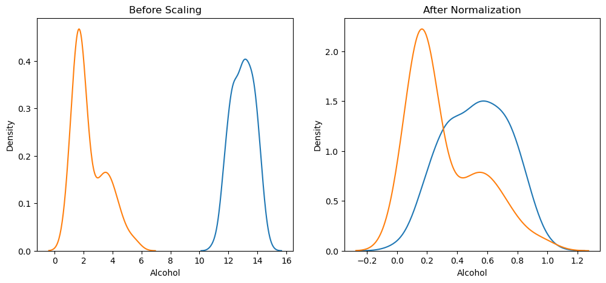

here we can see that there are 2 plots one before and one after scaling  
<h3>Before scaling-></h3> 
we can clearly see that Blue Curve (Alcohol):
~10 to 16
and Orange Curve (Malic acid): 
The scales are very different, which is bad for many ML algorithms 
Alcohol dominates because of its larger numeric range. 
<h3>After Standard Scaling-></h3> 
Now the data is between 0 and 1
and Alcohol and malic acid are now in the same scale

